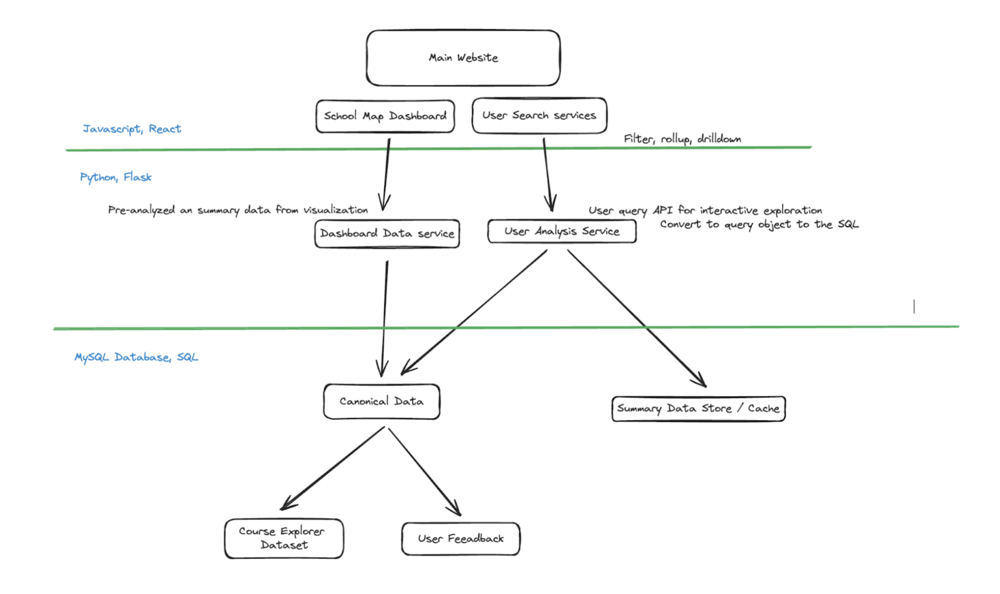

# CS222 Improved Course Explorer

## Description

This is a improved course explorer that for students easily query course they like based on Gen-Ed requirements, Average GPA or rate of professor.  

## Contributing
 - Jarrett Cura, netid cura2, collect data from course explorer api and ratemyprofessor api, and then write algorithms to process courses data. Parse each course with their average gpa and professor's information. Then store data into database and make them ready to use. And build up the 'Professor' page.
 - Ruiqing Yu, netid ruiqing6, setup the frontend and defined the tech-stack used for frontend development. Then build up the website's pages like the home page and 'Gen-Ed' page. Integrate backend's API, enable functionalities for students to use. Modify backend API based on needs.
 - Yixuan Xie, netid xie39, mainly worked on the backend development. Construct flask APIs and query to grab data from MongoDB. Help pre-process and clean raw data. Deployed the frontend website using Vercel, and deployed the backend server using AWS EC2. 
 - Caleb Yu, netid cyu62, help process raw data for the backend. Build up the 'About' page and the 'Subject' page. 

## Technical Architecture



## File Structure

Frontend and backend code base are seperate directory under the app directory. 

## Prerequisites

Before you begin, ensure you have met the following requirements:

- Python is installed on your system.

## Setup and Installation

Follow these steps to set up your development environment for the project.

### Setting Up Node.js Environment for Frontend

1. **Install Nodeenv**

   Nodeenv is a tool to create isolated Node.js environments. It's useful for managing multiple Node.js versions. Install it globally using pip:

   ```sh
   pip install nodeenv
   ```

2. **Create a Node.js Virtual Environment**

   After installing nodeenv, create a new Node.js virtual environment. In this example, we're using Node.js version 20.1.0:

   ```sh
   nodeenv --node=20.1.0 env
   ```

   Activate the virtual environment:

   ```sh
   source env/bin/activate
   ```

3. **Install PNPM**

   PNPM is a fast, disk space efficient package manager for JavaScript. Install it globally:

   ```sh
   npm install -g pnpm
   ```

4. **Create a Vite React Project**

   Use Vite to create a new React project. Replace `my-react-app` with your desired project name:

   ```sh
   pnpm create vite my-react-app --template react
   ```

   Select Typescipt as programming language
   Navigate into your project directory:

   ```sh
   cd my-react-app
   ```

   Install the dependencies:

   ```sh
   pnpm install
   ```
  Run this everytime pull newer version code from github. 

### Setting Up Python Flask Backend

1. **Install Flask and other dependencies**

   We mainly Flask and MongoDB for the backend development and database. Install them all using pip:

   ```sh
   pip install -r requirements.txt
   ```

## Running the Project

To run the project locally, need to start the frontend and backend processes in two terminals. 

In the first terminal, go to the frontend directory and execute:

```sh
pnpm run dev
```

This command starts the local frontend development server. Open your browser and navigate to `http://localhost:3000` to see your React application.

Then goes to the backend directory in a new terminal and execute:

```sh
flask run
``` 

---

For more information on `nodeenv`, visit the [official documentation](https://pypi.org/project/nodeenv/).
